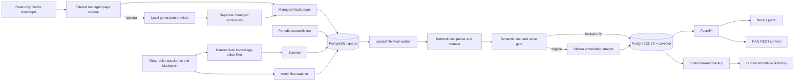

# System architecture

The PostgreSQL queue uses `FOR UPDATE SKIP LOCKED`, lease expiry, bounded retry, dead-letter status, idempotency keys, per-document advisory locks, and partial claim/recovery indexes. A watcher only enqueues work. Periodic reconciliation is the correctness backstop.

Windows paths are resolved before use, compared with `os.path.commonpath`, stored using canonical Windows separators, and compared case-insensitively for idempotency. Reparse points are not traversed. `(source_root_id, canonical_path)` is unique.

Markdown chunks preserve frontmatter, heading hierarchy, source lines, and content hashes. Code parsing currently provides deterministic symbol-pattern chunks and a line-window fallback; tree-sitter is the planned parser adapter for broader grammar-specific extraction.

Codex capture uses the official hook-provided transcript path or a read-only polling fallback.
Only displayed user/assistant messages cross the boundary into generated Markdown. Internal
reasoning, tool I/O, and system/developer instructions are excluded. Writes are atomic and limited
to `_generated/codex-sessions`; transcript sources are never changed.

Local generation is an optional adapter and is not part of the required ingestion path. The
implemented Ollama adapter uses `/api/chat` with a JSON schema, non-streaming responses,
temperature zero, and explicit model digest validation. Its output is a separate managed page
whose frontmatter records provider, model, digest, source hash, and pipeline revision. An LLM
failure leaves raw capture and lexical search healthy.

Raw hook transport, activity history, searchable files, semantic vectors, and canonical knowledge
cases are separate promotion levels. The collector filters lifecycle/read-only noise before
creating an activity row. Generated tokenizer payloads are excluded; code, nested Git dependencies,
lockfiles, and oversized/high-chunk documents remain lexical-only by default with an explicit skip
reason. Project identity uses the top-level Git repository below the source root, while provenance
retains both source-root-relative and project-relative paths. See
[ADR 0006](../adr/0006-knowledge-value-selection.md) and
[ADR 0007](../adr/0007-purpose-scoped-retrieval.md).

The durable unit remains one file, but execution policy is workload-aware. Semantic Markdown jobs
use conservative model cooldowns; lexical code/dependency jobs use a larger burst under a one-CPU
worker limit and never call Ollama. This preserves per-file recovery while preventing an initial
catalog scan from becoming a model workload.

References: [Ollama chat API](https://docs.ollama.com/api/chat) and
[structured outputs](https://docs.ollama.com/capabilities/structured-outputs).

Lexical retrieval combines simple `tsvector`, GIN, trigram, and path/symbol conditions. Semantic retrieval filters by explicit embedding revision and uses cosine distance. Hybrid retrieval uses Reciprocal Rank Fusion and exposes component scores.
