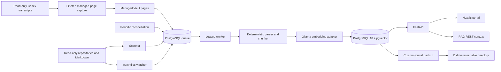

# System architecture

The PostgreSQL queue uses `FOR UPDATE SKIP LOCKED`, lease expiry, bounded retry, dead-letter status, idempotency keys, and per-document advisory locks. A watcher only enqueues work. Periodic reconciliation is the correctness backstop.

Windows paths are resolved before use, compared with `os.path.commonpath`, stored using canonical Windows separators, and compared case-insensitively for idempotency. Reparse points are not traversed. `(source_root_id, canonical_path)` is unique.

Markdown chunks preserve frontmatter, heading hierarchy, source lines, and content hashes. Code parsing currently provides deterministic symbol-pattern chunks and a line-window fallback; tree-sitter is the planned parser adapter for broader grammar-specific extraction.

Codex capture uses the official hook-provided transcript path or a read-only polling fallback.
Only displayed user/assistant messages cross the boundary into generated Markdown. Internal
reasoning, tool I/O, and system/developer instructions are excluded. Writes are atomic and limited
to `_generated/codex-sessions`; transcript sources are never changed.

Lexical retrieval combines simple `tsvector`, GIN, trigram, and path/symbol conditions. Semantic retrieval filters by explicit embedding revision and uses cosine distance. Hybrid retrieval uses Reciprocal Rank Fusion and exposes component scores.
